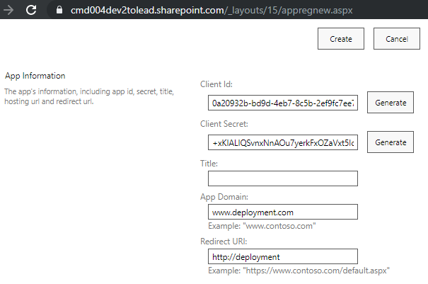
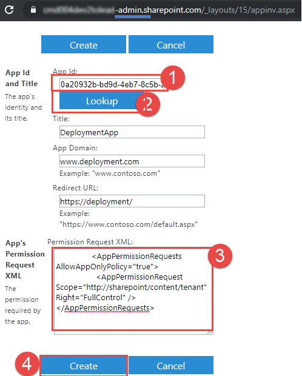
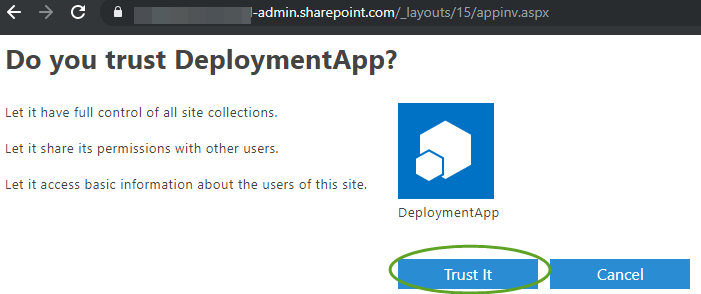
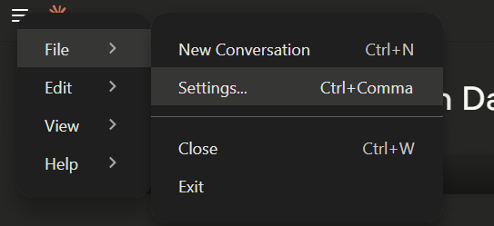
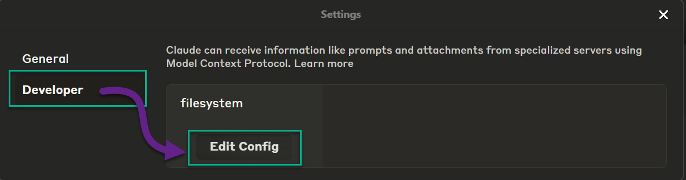
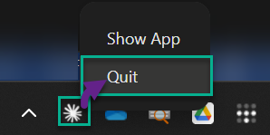
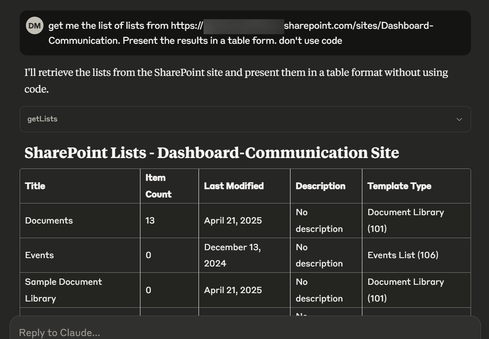

# SharePoint Online MCP Server

This is a MCP server for Claude Desktop that allows you to interact with SharePoint Online using the SharePoint REST API. It is designed to be used with the [Claude Desktop](https://claude.ai/download) app, but could be used by other MCP clients as well.

## Implementation

| Component          | Operation           | Available |
|--------------------|---------------------|-----------|
| Users              |                     | ❌        |
|                    | Read User           | ❌        |
|                    | Find User           | ❌        |
| Sites              |                     | ❌        |
|                    | Get Site Title      | ✅        |
|                    | List Sites          | ❌        |
|                    | Get Site Details    | ❌        |
|                    | Create Subsite      | ❌        |
|                    | Delete Site         | ❌        |
| Lists              |                     | ❌        |
|                    | Get All Lists       | ✅        |
|                    | Create List         | ❌        |
|                    | Read List           | ❌        |
|                    | Add to List         | ❌        |
|                    | Update List         | ❌        |
|                    | Delete List         | ❌        |
| List Items         |                     | ❌        |
|                    | Get All List Items  | ✅        |
|                    | Create Mock Items   | ✅        |
|                    | Create List Item    | ❌        |
|                    | Read List           | ❌        |
|                    | Add to List         | ❌        |
|                    | Update List         | ❌        |
|                    | Delete List         | ❌        |

## Configuration steps

⚠️ You need to be a SharePoint tenant admin or a global admin to create a SharePoint app.

### Allow SharePoint-only apps

- Download and install the SharePoint Online Management Shell from [here](https://www.microsoft.com/en-ca/download/details.aspx?id=35588).
- Open PowerShell and run the following command to make sure the SharePoint-only apps are enabled:

```powershell
Connect-SPOService -Url https://<your-tenant>-admin.sharepoint.com/
Set-SPOTenant -DisableCustomAppAuthentication $false
```

### Create SharePoint-only App

- Open https://<your-tenant>.sharepoint.com/_layouts/15/appregnew.aspx
- click `Generate` to create a new client ID and secret.
- Fill in the following fields:
  - App Domain: `www.example.com` (or any domain you own)
  - Redirect URL: `http://example.com`

- Click `Create` to create the app.
- Copy the `Client ID` and `Client Secret` values to a safe place. You will need them later.

### Grant App Permissions

- Open https://<your-tenant>.sharepoint.com/_layouts/15/appinv.aspx
- Paste the `Client ID` value in the `App Id` field and click `Lookup`.

- Paste the following XML in the `App Permission Request XML` field:

```xml
<AppPermissionRequests AllowAppOnlyPolicy="true">
   <AppPermissionRequest Scope="http://sharepoint/content/tenant" Right="FullControl" />
</AppPermissionRequests>
```

- Click `Create` and then `Trust It` to grant the app permissions.



### Install Node.js

 Install node.js version: [22.14.0 or later](https://nodejs.org/en/download)

### Install abd Configure Claude Desktop

- Download [Claude Desktop](https://claude.ai/download) and install it.
- In Claude Desktop, go to `File` > `Settings` > `Developer`.

- Click Config

- Open the claude_desktop_config.json config file in the editor.
- Paste the following to the config and update the `mcpServers` section with your own values:

```json
{
  "mcpServers": {
    "server-sharepoint": {
      "command": "npx",
      "args": [
        "-y",
        "server-sharepoint"
      ],
      "env": {
        "SHAREPOINT_CLIENT_ID": "<your-client-id>",
        "SHAREPOINT_CLIENT_SECRET": "<your-client-secret>",
        "SHAREPOINT_TENANT_ID": "<your-tenant-id>"
      }
    }
  }
} 

```

> 💡[Learn how to get the tenant ID from Entra ID](https://learn.microsoft.com/en-us/entra/fundamentals/how-to-find-tenant)

- Save the config file and restart Claude Desktop. Make sure to quick the app completely via the tasks tray icon:


## How to "talk" to the MCP Server

- Open Claude Desktop and ask a question like `Get me the list of lists from https://<your-tenant>.sharepoint.com/sites/Dashboard-Communication. Present the results in a table form. don't use code`.

