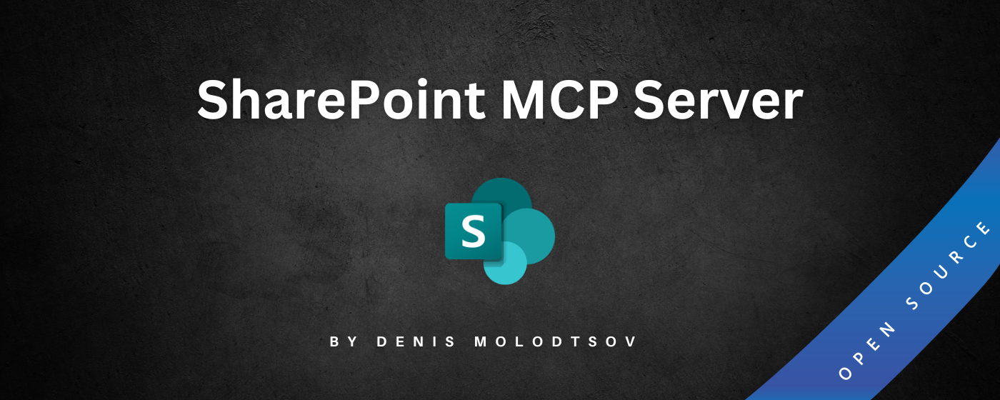

# SharePoint Online MCP Server 🚀

[](https://nodejs.org/en/download/)
[](https://learn.microsoft.com/en-us/sharepoint/dev/sp-add-ins/get-to-know-the-sharepoint-rest-service)
[](https://www.npmjs.com/package/server-sharepoint)
[](https://github.com/Zerg00s/server-sharepoint/blob/main/LICENSE)
[](https://www.microsoft.com/en-us/microsoft-365/sharepoint/collaboration)



Most powerful SharePoint MCP server enabling seamless interaction with SharePoint Online through the SharePoint REST API.

This MCP server is designed to be used with the [Claude Desktop](https://claude.ai/download) app, but could be used by other MCP clients as well.

## SharePoint Operations Availability

### Users

| Operation | Available |
|-----------|-----------|
| List Site Users by Role | ✅ |
| List Site Groups | ✅ |
| Get Group Members | ✅ |
| Add Group Member | ✅ |
| Remove Group Member | ✅ |

### Sites

| Operation | Available |
|-----------|-----------|
| Get Site Details | ✅ |
| Update Site Properties | ✅ |
| Get Global Navigation Links | ✅ |
| Get Quick Navigation Links | ✅ |
| Add Navigation Link | ✅ |
| Update Navigation Link | ✅ |
| Delete Navigation Link | ✅ |
| Get Subsites | ✅ |
| Create Subsite | ❌ |
| Delete Subsite | ✅ |

### Regional Settings

| Operation | Available |
|-----------|-----------|
| Get Regional Settings | ✅ |

### Features

| Operation | Available |
|-----------|-----------|
| Get Site Collection Features | ✅ |
| Get All Site Features | ✅ |
| Get Site Feature | ✅ |
| Get All Site Feature | ✅ |

### Lists

| Operation | Available | Notes |
|-----------|-----------|--|
| Get All Lists | ✅ |  |
| Create List | ✅ |  |
| Add Site Content Type to list | ✅ |  |
| Remove Content Type from list | ✅ |  |
| Add Field to List Content Type | ❌ |  |
| Remove Field from List Content Type | ❌ |  |
| Update List | ✅ |  |
| Get List Fields | ✅ |  |
| Create List Field | ✅ | Basic scenarios only  |
| Update List Field | ✅ |  |
| Delete List Field | ✅ |  |
| Set List Field formatting | ❌ |  |
| Set List View formatting | ❌ |  |
| Delete List | ✅ |  |

### List Views

| Operation | Available |
|-----------|-----------|
| Get List Views | ✅ |
| Delete List View | ✅ |
| Create List View | ✅ |
| Update List View | ✅ |
| Get View Fields | ✅ |
| Add View Field | ✅ |
| Remove View Field | ✅ |
| Remove All View Fields | ✅ |
| Move View Field | ✅ |

### List Content Types

| Operation | Available | Notes |
|-----------|-----------|--|
| Get All List Content Types | ✅ | |
| Get List Content Type | ✅ | |
| Create List Content Type | ❌ | Change CT title and group only |
| Update List Content Type | ✅ | |
| Delete List Content Type | ✅ | |

### List Items

| Operation | Available |
|-----------|-----------|
| Get All List Items | ✅ |
| Create List Item | ✅ |
| Update List Item | ✅ |
| Delete List Item | ✅ |

### Site Content Types

| Operation | Available | Notes |
|-----------|-----------|-|
| Get All Site Content Types | ✅ | |
| Get Site Content Type | ✅ | |
| Create Site Content Type | ❌ | |
| Update Site Content Type | ✅ | Change CT title and group only |
| Delete Site Content Type | ✅ | |

### Pages

| Operation | Available |
|-----------|-----------|
| Create Modern Page | ✅ |
| Delete Modern Page | ✅ |
| List Modern Pages | ✅ |
| Add Page Web Part | ❌ |
| Delete Page Web Part | ❌ |
| Move Page Web Part | ❌ |
| Update Page Web Part | ❌ |

### Documents

| Operation | Available |
|-----------|-----------|
| Create Document | ❌ |
| Upload Document | ❌ |
| Move Document | ❌ |
| Copy Document | ❌ |

### Taxonomy

| Operation | Available |
|-----------|-----------|
| Get Taxonomy Group | ❌ |
| Create Taxonomy Label | ❌ |
| Update Taxonomy Label | ❌ |
| Delete Taxonomy Label | ❌ |

### Authentication Options

The server supports two authentication methods:

1. **Client Secret Authentication** - Traditional client ID and secret. It's the App-only authentication that is deprecated and will not work after April 2026.
2. **Certificate Authentication** - More modern method using Azure AD App Registration with certificate

### Option 1: Client Secret Authentication (Will not work after April 2026)

This option requires the SharePoint administrator role.

#### Configuration steps

⚠️ You need to be a SharePoint tenant admin or a global admin to create a SharePoint app.

### Allow SharePoint-only apps

- Download and install the SharePoint Online Management Shell from [here](https://www.microsoft.com/en-ca/download/details.aspx?id=35588).
- Open PowerShell and run the following command to make sure the SharePoint-only apps are enabled:

```powershell
Connect-SPOService -Url https://<your-tenant>-admin.sharepoint.com/
Set-SPOTenant -DisableCustomAppAuthentication $false
```

#### Create SharePoint-only App with Client Secret

- Open `https://<your-tenant>.sharepoint.com/_layouts/15/appregnew.aspx`
- Click `Generate` to create a new client ID and secret.
- Fill in the following fields:
  - App Domain: `www.example.com` (or any domain you own)
  - Redirect URL: `http://example.com`

- Click `Create` to create the app.
- Copy the `Client ID` and `Client Secret` values to a safe place. You will need them later.

#### Grant App Permissions

- Open `https://<your-tenant>.sharepoint.com/_layouts/15/appinv.aspx`
- Paste the `Client ID` value in the `App ID` field and click `Lookup`.

- Paste the following XML in the `App Permission Request XML` field:

```xml
<AppPermissionRequests AllowAppOnlyPolicy="true">
   <AppPermissionRequest Scope="http://sharepoint/content/tenant" Right="FullControl" />
</AppPermissionRequests>
```

- Click `Create` and then `Trust It` to grant the app permissions.


### Option 2: Certificate Authentication

Certificate-based authentication provides better security than client secrets. It uses a certificate to prove the identity of the application instead of a shared secret.

> ⚠️ This option requires the Global administrator role to provide the necessary permissions to the app.

#### Clone the repo

```bash
git clone https://github.com/Zerg00s/server-sharepoint.git
```

#### Create Azure AD App with Certificate

Navigate to the cloned repo and use the provided PowerShell script to create the Azure AD app with certificate:

```powershell
.\Create-SPAppCertificate.ps1 -AppName "SharePoint-Server-MCP" -CertName "SharePoint-Server-MCP-Cert" -CertPassword "YourSecureP@ssw0rd!"
```

This script will

1. Create a self-signed certificate in your certificate store
2. Register an Azure AD application
3. Add the certificate to the application
4. Configure the required SharePoint permissions
5. Generate configuration files with the necessary settings
6. Output the `claude_desktop_config.json` that is compatible with Claude Desktop

#### Grant Admin Consent

After running the script, you'll get an Admin Consent URL. Open it in a browser and sign in as a Global Admin to grant consent for the permissions.

### Install Node.js

Install Node.js version: [22.14.0 or later](https://nodejs.org/en/download)

### Install and Configure Claude Desktop

- Download [Claude Desktop](https://claude.ai/download) and install it.
- In Claude Desktop, go to `File` > `Settings` > `Developer`.

- Click Edit Config

- Open the claude_desktop_config.json config file in the editor. You can also use the claude_desktop_config.json file generated by the PowerShell script earlier.
- Paste the following to the config and update the `mcpServers` section with your own values:

#### For Certificate Authentication

```json
{
  "mcpServers": {
    "server-sharepoint": {
      "command": "npx",
      "args": [
        "-y",
        "server-sharepoint"
      ],
      "env": {
        "AZURE_APPLICATION_ID": "<your-app-id>",
        "AZURE_APPLICATION_CERTIFICATE_THUMBPRINT": "<your-certificate-thumbprint>",
        "AZURE_APPLICATION_CERTIFICATE_PASSWORD": "<your-certificate-password>",
        "M365_TENANT_ID": "<your-tenant-id>"
      }
    }
  }
} 

```

#### For Client Secret Authentication (not recommended)

```json
{
  "mcpServers": {
    "server-sharepoint": {
      "command": "npx",
      "args": [
        "-y",
        "server-sharepoint"
      ],
      "env": {
        "SHAREPOINT_CLIENT_ID": "<your-client-id>",
        "SHAREPOINT_CLIENT_SECRET": "<your-client-secret>",
        "M365_TENANT_ID": "<your-tenant-id>"
      }
    }
  }
} 
```

> 💡[Learn how to get the tenant ID from Entra ID](https://learn.microsoft.com/en-us/entra/fundamentals/how-to-find-tenant)

- Save the config file and restart Claude Desktop. Make sure to quit the app completely via the tasks tray icon:


## How to "talk" to the MCP Server

- Open Claude Desktop and ask a question like `Get me the list of lists from https://<your-tenant>.sharepoint.com/sites/Dashboard-Communication. Present the results in a table form. don't use code`.


----------------------------------------------------------------

## For Contributors

- Build a new npm package

```bash
npm run build
npm publish
npx clear-npx-cache
npm cache clean --force
```

## Run MCP Inspector locally

```bash
npx @modelcontextprotocol/inspector node build/src/index.js
```

## MCP Server Context 7 Documentation for LLMs

[https://context7.com/modelcontextprotocol/servers](MCP Server Context 7 Documentation for LLMs)

## Local Development

- Clone the repo
- `nvm use 22.14.0`
- `npm install`
- Update MCP config in `claude_desktop_config.json` file. Sample:

For client secret authentication (Will not work after April 2026)

```json
{
"mcpServers": {
  "sharepoint": {
      "command": "node",
      "args": [
        "C:\\trash\\server-sharepoint\\build\\index.js"
      ],
      "env": {
        "SHAREPOINT_CLIENT_ID": "aaa2ce0f-7c97-4e51-acd9-4ac99e6831d0",
        "SHAREPOINT_CLIENT_SECRET": "bbb0OFF+aWkua2NJRERUMGduMmhsWDhGUTVPUHJZLXd5dldSemNPUw==",
        "M365_TENANT_ID": "22bcd981-eaa6-475f-aac3-3afca0c35261"
      }
    }
  }
}
```

For certificate authentication (Recommended)

```json
{
"mcpServers": {
  "sharepoint": {
      "command": "node",
      "args": [
        "C:\\trash\\server-sharepoint\\build\\index.js"
      ],
      "env": {
        "AZURE_APPLICATION_ID": "5bc793c7-3eb0-4b86-88bf-b464b2459c4c",
        "AZURE_APPLICATION_CERTIFICATE_THUMBPRINT": "3D38D1D8AC3228CAD35E527D1105101B0B90CE86",
        "AZURE_APPLICATION_CERTIFICATE_PASSWORD": "TemporaryP@ssw0rd",
        "M365_TENANT_ID": "11bcd981-eaa6-475f-aac3-3afca0c35261"
      }
    }
  }
}
```

- Make changes to the code
- Build the code `npm run build`
- Test with MCP Inspector: `npx @modelcontextprotocol/inspector node build/src/index.js -y`
